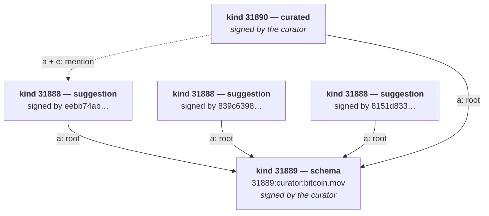

# bitcoin.mov event reference

Three event kinds, three kinds of author. Everything else in this project is
plumbing around them.

| kind | | who signs it | detail |
|---|---|---|---|
| **31889** | **schema event** — what a suggestion may contain, and whose list this is | the curator | [schema-events.md](schema-events.md) |
| **31888** | **suggestion event** — a title someone proposes | anyone | [suggestion-events.md](suggestion-events.md) |
| **31890** | **curated event** — a suggestion the curator signed off on | the curator only | [curated-events.md](curated-events.md) |

All three are **addressable** (Nostr's 30000–39999 range), so the coordinate
`(kind, pubkey, d)` is unique and republishing with the same `d` *replaces* the
previous version rather than adding a second one. That single property is what
makes entries editable, schemas revisable, and every seed script safe to re-run.

## How they fit together



A pubkey publishes a **schema**. Anyone replies to it with **suggestions** that
satisfy it. The pubkey that published the schema goes through them and
republishes the ones it accepts as **curated events** — same fields, signed by
the curator, pointing back at the suggestion they came from.

The list is literally the thread of replies to its own schema. `#a` on the
schema's coordinate is the query that fetches it.

## The walkthrough, with real events

Everything below is produced by the seed scripts, so you can generate it
yourself:

```bash
NOSTR_NSEC=nsec1yourkeyhere npm run seed
```

**1. The curator publishes a schema.** Their pubkey becomes the namespace:
`31889:7c965d8c…:bitcoin.mov`. The schema says a suggestion needs a `d`, a
`title` and a `type`, plus at least one link; it may also carry a year, a
director, a poster and so on. It also carries the list's own identity — the
name "bitcoin.mov", a description, and `visibility: public`, meaning anyone may
suggest.

**2. A stranger suggests a film.** `eebb74ab…` publishes a kind 31888 event with
`["title","The Rise and Rise of Bitcoin"]`, a watch link, an IMDb link, a
poster — and `["a","31889:7c965d8c…:bitcoin.mov","","root"]`, which is what makes
it part of *this* list rather than floating loose on the relay.

**3. The curator signs off on it.** They read the suggestion back into its
field values, correct anything that needs correcting, and republish it as kind
31890 under their own key — keeping the suggestion's `d` (`imdb:tt2821314`),
still rooted at the schema, and adding `a`/`e`/`p` tags pointing at the
suggestion and crediting `eebb74ab…`.

In the app, that film now appears on the home page — which lists curated entries
only — marked *Curated*, with the suggestions behind it still reachable from
`/suggestions` and from the film's own page.

## Reading the list

| you want | query |
|---|---|
| the schema | `{kinds:[31889], authors:[curator], "#d":["bitcoin.mov"]}` |
| everything suggested | `{kinds:[31888], "#a":["31889:curator:bitcoin.mov"]}` |
| the curated list only | `{kinds:[31890], authors:[curator], "#a":["31889:curator:bitcoin.mov"]}` |

## Verification

Nothing is trusted because it arrived. Every event is checked against the
schema and **rejected rather than repaired** — relays carry malformed, partial
and hostile events from other apps, and a half-parsed entry is worse than a
missing one.

| function | checks |
|---|---|
| `verifySchemaEvent(event)` | it is a usable kind 31889 schema |
| `verifySuggestion(event, schema)` | fields, reply root, who may suggest |
| `verifyCuration(event, schema)` | all of the above, plus kind 31890 signed by the curator |

All three return `{ ok, violations[] }`, where each violation names a field and
says what is wrong with it. See each event's page for the exact rules.

```bash
npm run verify    # check every entry on a relay and report what fails
```

## Where this lives in the code

| | |
|---|---|
| [`lib/nostr/schemaEvent.ts`](../lib/nostr/schemaEvent.ts) | all three kinds — types, defaults, build, parse, verify |
| [`lib/nostr/schema.ts`](../lib/nostr/schema.ts) | turning entries into the app's display objects |
| [`lib/nostr/useVideos.ts`](../lib/nostr/useVideos.ts) | the relay subscriptions |
| [`scripts/`](../scripts) | publishing, seeding, curating, auditing |

`schemaEvent.ts` is deliberately dependency-free, with no relative imports, so
plain Node scripts can load it as well as the Next bundle. The seed script and
the browser therefore verify against the exact same definition rather than two
copies that drift. Keep it that way.
